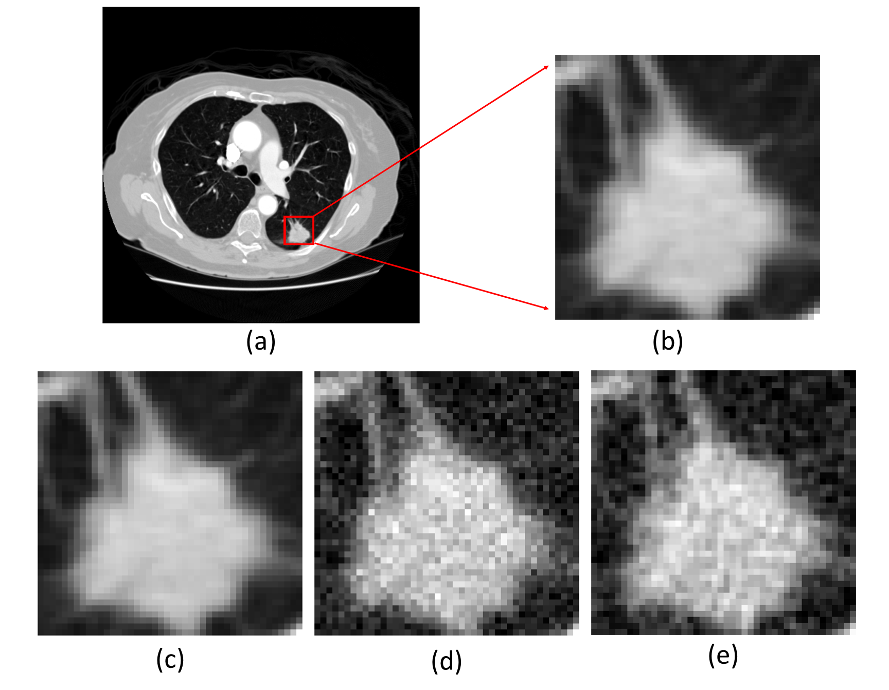

# PIDA 
## Physics-Informed Data Augmentation to simulate low dose CT scans: Application to Lung Nodule Detection
Our proposed Physics-Informed Data Augmentation (PIDA) method leverages the mAs and Noise Power Spectrum (NPS) profiles of various CT reconstruction
kernels to simulate the effects of various dose exposures. In this approach, the NPS
of a higher dose CT scan is used to generate correlated noise, which is then stochastically inserted into the training data. This simulates the noise characteristics of the
lower dose exposure and enhances variability within the training set. To demonstrate
PIDA’s applicability in improving the generalizability of CNNs, we applied PIDA in
training a neural network designed to reduce false positives in a lung nodule detection
algorithm. We evaluated the impact of the noise insertion training method by assessing
lung nodule detection performance on low-dose CT scans.

  

<em>Figure 1: Visualization of nodule candidate after our proposed physics-informed noise insertion technique. The top row shows a) a sample CT scan from LIDC-IDRI dataset, acquired at 400 mAs and reconstructed using a standard filter, and b) a cropped ROI, and the bottom row shows c) the cropped ROI without noise, d) with white-Gaussian noise, and e) with noise insertion based on our PIDA method. Images are shown with the same window level of -1000 to 400 HU.</em>

