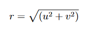

# Physics-Informed Data Augmentation (PIDA) to simulate low dose CT scans: Application to Lung Nodule Detection
This repository contains the code for **Physics-Informed Data Augmentation to simulate low dose CT scans: Application to Lung Nodule Detection**.
Our proposed **Physics-Informed Data Augmentation (PIDA)** method leverages the milliampere-seconds (mAs) and Noise Power Spectrum (NPS) profiles of various CT reconstruction
kernels to simulate the effects of various dose exposures. In this approach, the NPS of a higher dose CT scan is used to generate correlated noise, which is then stochastically inserted into the training data to simulate the noise characteristics of the lower dose exposure. We applied PIDA in training a neural network designed to reduce false positives in a lung nodule detection algorithm. We evaluated the impact of the noise insertion training method by assessing
lung nodule detection performance on low-dose CT scans.

PIDA is a method developed to simulate realistic low-dose CT noise based on imaging physics principles. Unlike conventional augmentation strategies that add uncorrelated Gaussian noise, PIDA injects spatially correlated noise into CT images to closely mimic the noise texture seen in clinical low-dose acquisitions. PIDA utilizes NPS profiles extracted from CT DICOM metadata to model noise. Assuming radial symmetry, the two-dimensional NPS is calculated as:
<p align="center">
  
</p>

where 𝑢 and 𝑣 are the spatial frequency coordinates. To simulate noise in the spatial domain, PIDA generates a noise field by randomizing phase information and applying an inverse Fourier transform:
<p align="center">
  
</p>
where sqrt of NPS(u,v) is the amplitude derived from the measured NPS,
φ(u, v) are random phase shifts uniformly sampled from [0, 2π],
F⁻¹ denotes the inverse Fourier transform. This approach ensures that the noise introduced into each training sample retains the same frequency characteristics (texture and granularity) as clinically acquired low-dose CT images.

During training, PIDA stochastically injects this correlated noise into images with varying magnitudes (noise standard deviation in the range [1, 5]) to emulate the noise conditions found in scans with different dose exposures (e.g., 20–80 mAs). By augmenting the training set in this physics-informed manner, PIDA improves generalizability and robustness of convolutional neural networks (CNNs) across CT datasets acquired with different radiation dose levels.

## Visualization of Nodule after PIDA
<p align="center">
  
</p>
<p align="center"><em>Figure 1: Visualization of nodule candidate after our proposed physics-informed noise insertion technique. The top row shows a) a sample CT scan from LIDC-IDRI dataset, acquired at 400 mAs and reconstructed using a standard filter, and b) a cropped ROI, and the bottom row shows c) the cropped ROI without noise, d) with white-Gaussian noise, and e) with noise insertion based on our PIDA method. Images are shown with the same window level of -1000 to 400 HU.</em></p>


##  Repository Structure
```bash
PIDA/
├── figures/                  # Visualizations and final result plots
├── annotations/              # Required for preprocessing nodules
├── data_preprocessing/       # Python script for train-test csv files generation
├── src/                      # Core Python scripts for train and test
│   ├── baseline_train.py     # Train CNN only on High Dose (HD) CT images of LIDC dataset
│   ├── baseline_test.py      # Test trained baseline on HD, Low-Dose (LD), and Standard-Dose (SD) CT images
│   └── PIDA_train.py         # Train baseline with PIDA on High Dose (HD) CT images
│   ├── PIDA_test.py          # Test on HD, LD, and SD CT images
│   ├── WGDA_train.py         # Train baseline with White-Gaussian (WG) Noise on High Dose (HD) CT images
│   └── WGDA_test.py          # Test on HD, LD, and SD CT images
│   ├── baseline_with_GA.py   # Train baseline with Geometric Augmentation (i.e., random rotation, scaling, transpose & flip) on 9 Folds of LUNA16 challenge, and tested on 10th Fold.
│   ├── PIDA_with_GA.py       # Train baseline with PIDA and Geometric Augmentation (i.e., random rotation, scaling, transpose & flip) on 9 Folds of LUNA16 challenge, and tested on 10th Fold.
│   └── WGDA_with_GA.py       # Train baseline with WG noise and Geometric Augmentation (i.e., random rotation, scaling, transpose & flip) on 9 Folds of LUNA16 challenge, and tested on 10th Fold.
├── model_checkpoints/        # model checkpoints for each of the network mentioned as *_train.py file in src directory
├── requirements.txt          # Required Python packages
├── README.md                 # Project documentation (this file)
```
## Data Source

This project uses annotation files in PIDA/annotations from the [LUNA16 challenge dataset](https://luna16.grand-challenge.org/Data/).

The LUNA16 dataset aggregates pulmonary nodule annotations from the publicly available LIDC-IDRI database. Access to the LUNA16 dataset is subject to its own terms and conditions. Users must obtain the data independently and adhere to the dataset's usage policies as specified by the dataset owners.

## License for Dataset

The LUNA16 dataset used in this project is distributed under its own terms of use. For more information, please refer to:
[https://luna16.grand-challenge.org/Data/](https://luna16.grand-challenge.org/Data/)

Please ensure compliance with the licensing and usage policies before using or distributing any derivative works based on the dataset.

## How to Run
We used virtual environment. Create an environment using packages in requirements.txt file.
This code was tested on **Python 3.11.4**. 
 Install required Python packages with:
   ```bash
   pip install -r requirements.txt
  ```
## Pre-Trained Models
We have pre-trained weights for each of the network in the following directory.
   ```bash
   cd model_checkpoints
```
## Train
Please use following scripts for training from scratch to reproduce our results.
```bash
cd src
python baseline_train.py
python PIDA_train.py
python WGDA_train.py
```
## Test
Please use following scripts to test the pre-trained network using weights in model_checkpoints.
```bash
cd src
python baseline_test.py
python PIDA_test.py
python WGDA_test.py
```
## Train & Test with Geometric Augmentation
```bash
cd src
python baseline_with_GA.py
python PIDA_with_GA.py
python WGDA_with_GA.py
```
# Authors
```bash
Moktari Mostofa
Jacob McIntosh
Qian Cao
Berkman Sahiner
Mehdi Farhangi
Nicholas Petrick
```
# Authors Contribution
Moktari Mostofa developed the pipeline and its functions, wrote the documentation, and drafted the article. Jacob McIntosh, and Qian Cao assisted in noise insertion augmentation of DICAugment library, which inspired to conduct this project. Berkman Sahiner and Nicholas Petrick assisted in designing the validation study. Mehdi Farhangi, and Nicholas Petrick supervised the project and contributed to the article drafting.

# Acknowledgments
We would like to express our gratitude to the developers of DICAugment [1](https://github.com/DIDSR/DICaugment) for their excellent work on the library, which served as the foundation for our PIDA.

# Reference
[1] McIntosh, J., et al. "DICaugment: A Python Package for 3D Medical Imaging Augmentation." Journal of Open Source Software 9.95 (2024): 6120


